## Rapport de test d’intrusion offensif 

## Table des matières

1. [Objectif](#objectif)
2. [Description de l’attaque](#description-de-lattaque)
3. [Machine cible 1 : 10.65.153.187](#machine-cible-1--1065153187)
   - [Informations avant l’attaque](#informations-avant-lattaque)
   - [Méthode d’attaque](#méthode-dattaque)
   - [Déroulement de l’attaque](#déroulement-de-lattaque)
   - [Fin de l’exploit 1](#fin-de-lexploit-1)
4. [Machine cible 2 : 10.66.128.115](#machine-cible-2--1066128115)
   - [Informations avant l’attaque](#informations-avant-lattaque-1)
   - [Méthode d’attaque](#méthode-dattaque-1)
   - [Utilisation de l’exploit](#utilisation-de-lexploit)
   - [Fin du deuxième exploit](#fin-du-deuxième-exploit)

---

## Objectif

L'objectif est d'effectuer un test d'intrusion sur deux machines cibles Vulnérables préparées à cette effet .

---

## Description de l’attaque

L’attaque s’effectue en plusieurs étapes :

- **Phase de reconnaissance et de balayage** : découverte des technologies utilisées, des versions des services, des ports ouverts, des utilisateurs présents sur le système et du système d’exploitation.
- **Phase d’exploitation et d’accès** : utilisation des outils d’attaque pour exploiter les vulnérabilités identifiées.

---

## Machine cible 1 : 10.65.153.187

### Informations avant l’attaque

Un balayage de ports montre plusieurs ports ouverts, notamment les ports TCP 135, 139 et 445.  
Le système identifié est **Windows 7 Professional**, avec les utilisateurs **John-pc** et **guest user**.

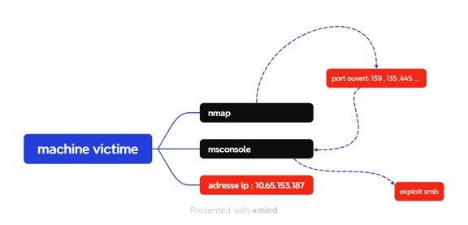

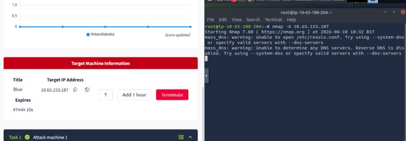

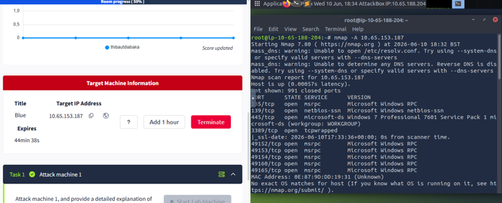

### Méthode d’attaque

L’exploitation est réalisée avec **Metasploit** en ciblant une vulnérabilité SMB sur le port 139.

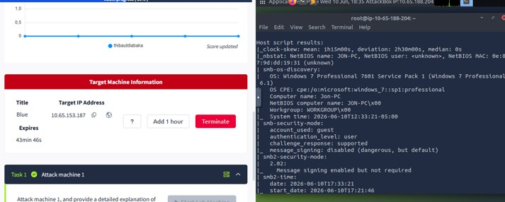

### Déroulement de l’attaque

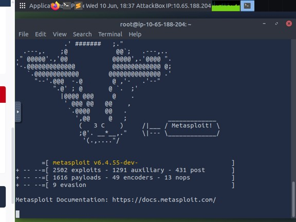

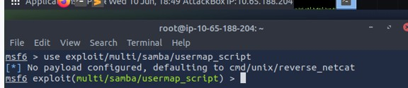

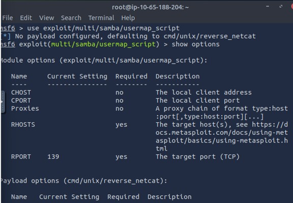

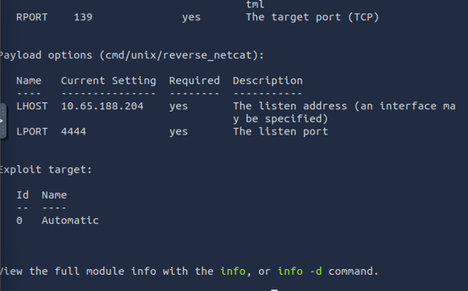

### Fin de l’exploit 1

L’exploitation de la première machine est terminée avec succès.

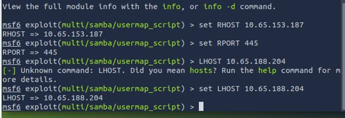

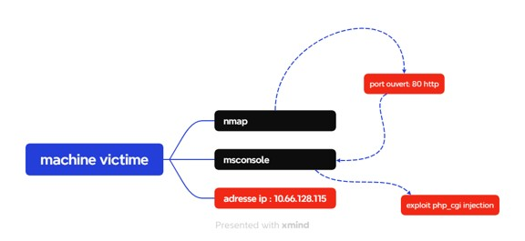

---

## Machine cible 2 : 10.66.128.115

### Informations avant l’attaque.

Le balayage de ports révèle que le port **80 HTTP** est ouvert.  
La version identifiée est **Apache**.

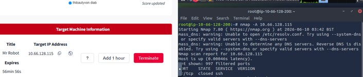

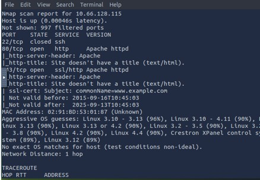

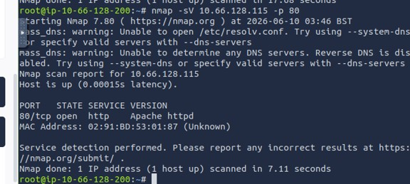

### Méthode d’attaque

L’exploitation est réalisée avec **Metasploit** en ciblant le service web sur le port 80.

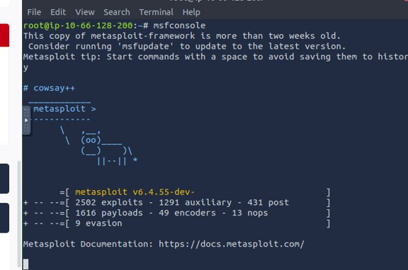

### Utilisation de l’exploit

Le rapport mentionne **PHP CGI** et la vulnérabilité **CVE-2024-4577**, liée au traitement Unicode dans le module CGI.

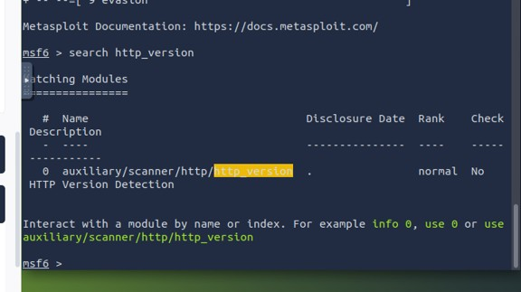

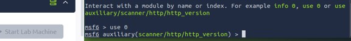

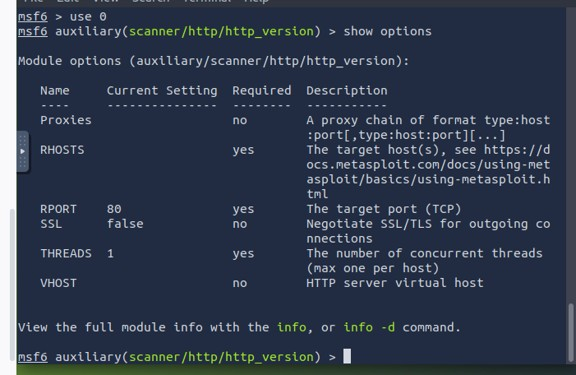

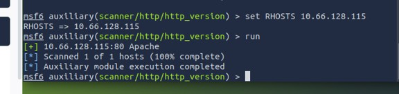

![Résultat étape 4]

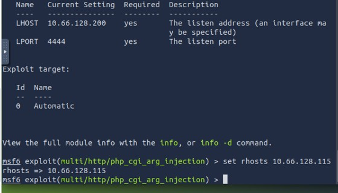

### Fin du deuxième exploit

La seconde exploitation est terminée avec succès.

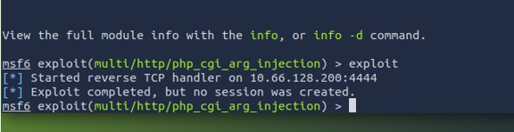

# TEST_DINTRUSION_ETHIQUE
